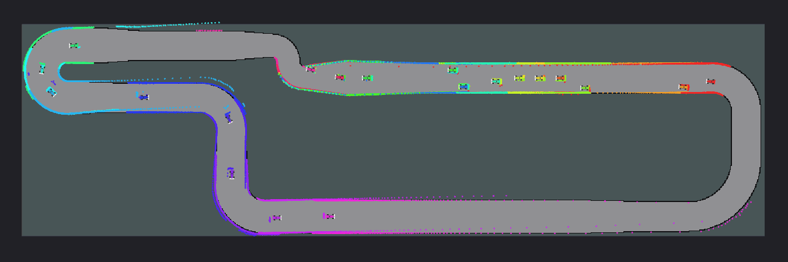

# SlipX



SlipX is a vehicle dynamics library for 1/10-scale autonomous racecars, plus the
simulation, ROS 2 and race control layers needed to make it usable. Apache-2.0,
C++17, CPU-only, no display server required.

**P0 is built. Everything after it is a plan.** What exists today is
`slipx_core` with tiers L0 and L1, the fixed-step orchestrator, `slipx_schema`
v0.1.0 with its reference parser, the Python bindings, and a determinism
harness. L2, the tier at which different cars actually behave differently, is
P1 and asking for it raises rather than quietly giving you L1. No parameter set
here has been checked against a real car, and the tooling says so every time it
loads one.

## Why

Take the tyre model in a game engine. Unity's `WheelCollider` and PhysX friction
curves are parameterised by extremum and asymptote points in the slip/force
curve. Nobody can measure those. You can't fit them to a rosbag, and there is no
principled way to express, in those terms, the difference between a sponge tyre
and a rubber tyre on the same floor. So the numbers get guessed, and once
they're in a config file somebody starts trusting them.

The parameters in SlipX are quantities you can go and measure. Cornering
stiffness, peak friction, load sensitivity, relaxation length: each one is
identifiable from a manoeuvre you can drive in a car park with the sensors
already on a competition car, meaning wheel encoders, an IMU, and LiDAR-based
pose. No dyno, no tyre rig, no force platform. That constraint is what the rest
of the design is arranged around.

## The library is the product, not the simulator

`slipx_core` is a C++17 library with no dependencies at all: the standard
library, and nothing else. The simulator consumes it. This ordering is
deliberate: there are already four or five 1/10-scale simulators, and shipping a
sixth is a poor bet. Being the physics layer inside the existing ones is a
better one.

Eigen was in that sentence until P0 started, and is not any more. The core needs
no solver, no decomposition and no dynamic sizing; every tier is a small
explicit expression in two and three dimensions. What Eigen would have
contributed was expression templates we do not use, a `find_package` in every
consumer's build, and one more thing to pin per platform in the determinism
argument. It was replaced by a 180-line header. Embedding SlipX now costs two
lines of CMake and no transitive dependency, which is the whole strategy stated
as a build system fact rather than as an intention.

Three consequences, all load-bearing:

`slipx_core` never grows a dependency on anything above it. No ROS, no threads,
no I/O, no logging framework, no allocation inside `step`. It has to build and
pass its whole test suite with `slipx_schema` absent, because parameters arrive
as a plain struct and parsing is somebody else's problem. CI breaks the build if
that stops being true.

The licence stays permissive. Apache-2.0 throughout. Copyleft anywhere in the
core would make embedding legally awkward, which defeats the point.

Bindings are written alongside the core rather than bolted on later: Python
through pybind11, a C ABI shim, and FMI 3.0 export for Simulink and similar
toolchains once there is something worth exporting.

The two-year target is `slipx_core` turning up as a dependency in a project we
don't maintain. Not a user count.

## Who it's for

| Segment | Need | Entry point |
|---|---|---|
| RoboRacer / F1TENTH teams | Tune a car before building it, test the stack before crashing it | ROS 2 simulator |
| RL researchers | Fast, deterministic, batchable rollouts with credible dynamics | Python / Gymnasium |
| Course instructors | Reproducible assignments that grade automatically and run on a student laptop | Headless CI mode |
| Competition organisers | A leaderboard that survives an appeal, and replay that isn't machine-specific | Deterministic mode + event stream |
| Simulator authors | A dynamics model better than the one currently in there | `slipx_core` C++ / C ABI |

## Layout of the stack

Dependencies point downward only. CI enforces it.

```
slipx_registry   community parameter sets (data only, no code)          P2
slipx_id         system identification: manoeuvres, fitting, reports    P2
slipx_ros        ROS 2 wrapper: topics, TF, /clock, rosbag, launch      P1
slipx            Python package: pybind11 bindings + Gymnasium adapter  built
slipx_sim        orchestrator: N agents, fixed step, lockstep, replay   built
slipx_scene      track loading, BVH, contact, race control, events      P1/P3
slipx_sense      sensor simulation: raycasting, noise, latency          P1
slipx_schema     JSON Schema definitions + reference parser             built
slipx_core       vehicle dynamics. Depends on: the C++ standard
                 library. Nothing else.                                 built
```

`tools/dep_lint.py` enforces this on every commit: it reads the includes, the
link lines and the Python imports, and fails the build if `slipx_core` acquires
a dependency on anything above it or on anything outside the standard library.
The rule will be broken by accident rather than on purpose, which is why it is
a script and not a paragraph.

The full component diagram, including the adoption surface it is aimed at, is in
[`docs/architecture/slipx.md`](docs/architecture/slipx.md).

### Core interface

Sketch, not final. What matters is the shape: no hidden state, `step` is `const`,
no allocation, no RNG, no clock. N instances then parallelise trivially and
snapshot/restore is a `memcpy`.

```cpp
namespace slipx {

enum class Tier { L0_Kinematic, L1_Bicycle, L2_DoubleTrack, L3_Extended };

struct DriveInput { double steer_cmd; double accel_cmd; };  // commanded, pre-actuator

class VehicleModel {
public:
  static std::unique_ptr<VehicleModel> create(Tier, const VehicleParams&);
  virtual void step(VehicleState&, const DriveInput&, double dt,
                    StepDiagnostics* out = nullptr) const = 0;
  virtual Tier tier() const = 0;
  virtual ~VehicleModel() = default;
};

}  // namespace slipx
```

`StepDiagnostics` is optional so the hot path stays cheap. When you ask for it
you get slip angles, slip ratios, per-tyre forces, load transfer terms and
actuator saturation flags, which between them let a student plot exactly why the
car spun.

Anything a tier cannot represent comes back as NaN, never zero. L0 has no tyres,
so its slip angles are NaN and a plot of them is empty; L1 has no way to
transfer load, so its load transfer terms are NaN. Zero is a number somebody
would plot and believe.

### Installing it

```
pip install .
slipx-conformance
```

That builds the extension through scikit-build-core, installs `slipx` and
`slipx_schema`, and ships the reference car inside the package, so there is
something to load without cloning anything. The last line prints the canonical
step steer's trajectory hash. On a build with a published row in
`conformance/reference_hashes.tsv` it should match; on anything else it is a
number about which nothing has been claimed, which is NFR-03 rather than a
fault. `python3 tools/exit_gate.py --expect <hash>` runs the whole check.

There is no PyPI release yet, so `pip install slipx` does not work and the
package name is not reserved.

### Building it

```
cmake -S . -B build -DSLIPX_BUILD_PYTHON=ON
cmake --build build -j
ctest --test-dir build
python3 -m pytest
```

Needs CMake 3.20 and a C++17 compiler. GoogleTest is fetched if it is not
installed; the Python parts want PyYAML, jsonschema and pybind11. None of that
touches `slipx_core`, which builds on its own:

```
cmake -S . -B build -DSLIPX_CORE_ONLY=ON && cmake --build build && ctest --test-dir build
```

That configuration switches off every layer above the core and runs its full
test suite without them, which is how CORE-01 is checked rather than asserted.

Embedding it is two lines:

```cmake
add_subdirectory(slipx)
target_link_libraries(your_simulator PRIVATE slipx::core)
```

### Using it

```python
import slipx

car = slipx.load_reference_car()      # or load_car("examples/cars/reference_1_10")
print(car.summary())        # leads with the provenance label. It says PROVISIONAL.

model = slipx.VehicleModel.create(slipx.Tier.L1_Bicycle, car.params)
state = slipx.VehicleState()
state.vel_body.x = 5.0

diagnostics = slipx.StepDiagnostics()
for _ in range(1000):
    model.step(state, slipx.DriveInput(steer_cmd=0.1), 1e-3, diagnostics)

print(state.yaw_rate, diagnostics.alpha_front, diagnostics.ay)
```

Same names, same units, same signs as the C++. A tutorial written in one
translates into the other line by line, because there is no second set of
semantics to keep in step.

The banner at the top runs on that same class of model: a single-track car with
a reduced Magic Formula tyre, closed loop on a skidpad, settled into a sustained
drift at about 42 degrees of body slip on opposite lock. It isn't an animation,
it's a 1 kHz integration sampled over one lap.
Run `python3 docs/assets/make_banner.py` to regenerate it.

### The tyre model

A reduced Magic Formula (MF-lite) with load sensitivity and combined slip. It
arrives with L2 in P1; what L1 has today is a linear tyre, `Fy = -C_alpha *
alpha`, clipped at `mu * Fz`. A clip is not a Magic Formula. There is no peak,
no falling branch beyond it, and therefore no mechanism by which the car spins:
L1 slides at the limit and recovers the moment the slip angle comes back. That
limitation is reported rather than hidden, since `StepDiagnostics` raises
`tyre_saturated` the instant the clip engages, so the point where L1 stops being
believable is a number you can plot rather than a feeling you develop.

The schema already accepts and validates the full MF-lite parameter set, so an
identified tyre file contributed today will still be correct when L2 lands.
Every parameter earns its place by being identifiable:

| Symbol | Meaning | Identifiable from |
|---|---|---|
| `C_alpha0` | Cornering stiffness at nominal load | Skidpad, low-slip region |
| `mu_y0`, `mu_x0` | Peak lateral / longitudinal friction | Circle-to-slip, straight-line accel |
| `k_mu` | Load sensitivity exponent | Skidpad at two ballast configurations |
| `B`, `C`, `E` | MF shape factors | Full slip sweep |
| `sigma` | Relaxation length | Step steer transient |

Full Pacejka 5.2 is not the goal. A parameter nobody can identify is worse than
one that doesn't exist, because it gets guessed and then trusted.

Tyres are referenced as a `(compound, surface)` pair rather than embedded in the
car file. The same car on carpet and on polished concrete is two different
vehicles, and the schema should say so rather than let someone quietly carry
asphalt coefficients into a sports hall.

## Determinism

Fixed step, seeded per agent, lockstep barrier, headless. Every run writes a
manifest hashing the schema versions, parameter files, seeds, integrator, git
SHA, compiler ID and flags.

Same manifest and same input sequence gives a bit-identical replay on the same
platform. That needs `-ffp-contract=off`, no `-ffast-math`, no `-march=native`,
a fixed reduction order, and no multithreading inside the integrator.

Across platforms, bit-identity is not promised. A conformance suite asserts
agreement within a stated tolerance on x86-64 and aarch64, and the tolerance is
published rather than glossed over.

That distinction shapes how the check is built. A single pinned hash in a test
would pass on the machine it was recorded on and fail everywhere else, and the
only way to make it pass everywhere would be to weaken it to a tolerance, which
is where nondeterminism hides. So `conformance/reference_hashes.tsv` is keyed by
architecture, compiler and build type. A run is compared against the row
matching its own build; a mismatch there is a bug, and a build with no row is a
build about which nothing was claimed.

```
$ python3 tools/check_conformance.py
  L0/rk4                       d74f90169a5951c2  matches reference
  L0/semi_implicit_euler       44b1d28010f293c4  matches reference
  L1/rk4                       d44a9a68616ec899  matches reference
  L1/semi_implicit_euler       9a2532ced2e1e06d  matches reference
```

One observation worth recording, and worth not over-reading: on x86-64, GCC 11
and Clang 18 produce identical hashes for all four cases. That is what the
`-ffp-contract=off` discipline is for. It is an observation about two compilers
on one architecture, it is in the reference file as two sets of rows rather than
one, and it is not a promise.

## Roadmap

Each phase ends on something external. Internal milestones are how a project
convinces itself it's progressing while nobody adopts it.

**P0, weeks 0-6. Foundation. Built.** `slipx_core` with L0 and L1,
`slipx_schema` v0.1.0, Python bindings, determinism job in CI.
*Done when:* someone else pip-installs it, integrates a step steer, and gets the
same trajectory hash as CI. The machinery is in place and the gate is not
closed: it closes when somebody who is not us runs `slipx-conformance` and
reports a match.

**P1, weeks 6-14. A car worth believing.** L2 double-track with load transfer
and combined-slip MF-lite; ESC with current limit, regen and battery sag;
steering servo rate limit and lag; spool / open / LSD; 2D LiDAR with per-ray
timestamps, motion distortion, latency, dropouts; IMU and encoders; one track;
`slipx_ros`; a wall-follower and pure pursuit to check it with.
*Done when:* a team points their existing stack at it with a remap file and a
tuning change made in sim survives contact with their real car.

**P2, weeks 14-22. Identification.** Manoeuvre library (skidpad, step steer,
ramp steer, straight-line accel, coastdown, circle-to-slip), the fitter that
turns a rosbag2 into `dynamics.yaml` with residuals and confidence intervals,
replay validation reports, and the registry.
*Done when:* three parameter sets in the registry come from people who aren't
us, each with a validation report attached.

**P3, weeks 22-32. Racing.** N-agent lockstep with a timeout policy, planar
impulse contact, rollover as a DNF event, the published RoboRacer procedures,
structured event stream, CI leaderboard harness.
*Done when:* a course or a competition runs an evaluation on it.

**P4, weeks 32-42. 3D sensing.** Embree-backed CPU raycaster, pluggable scan
patterns (rotating multi-ring, non-repetitive rosette, solid-state), 3D track
geometry, intensity with reflectivity and incidence falloff.
*Done when:* a team with a real Mid-360 or Unitree L1 runs their point cloud
pipeline against it unmodified.

**P5, from week 30. Ecosystem.** `f1tenth_gym` backend adapter, FMI 3.0 export,
C ABI shim, Formula Student scale as schema extension fields.
*Done when:* `slipx_core` is a declared dependency somewhere we don't have
commit access.

P2 sits before P3 on purpose, and it's the one sequencing choice worth arguing
about. Racing features are more fun and more visible. But identification is what
makes the physics claim true, and a registry compounds: every month it exists it
gathers parameter sets we could never have produced on our own. Racing features
don't compound.

## What it isn't

Worth stating early so nobody arrives expecting the wrong thing.

There is no photorealistic rendering. SlipX is LiDAR-first and runs on CPU. No
HDRP, no path tracing, no camera in v1. A GPU path can be added behind the
existing sensor interface if a competition ever makes cameras load-bearing.

No full-scale road vehicles, traffic, pedestrians or urban scenarios. No
autonomy stack; the reference controllers exist to validate the sim, not to win
with. No hardware, no reference chassis BOM. No aerodynamics at 1/10 scale,
where it's negligible below roughly 15 m/s.

Collision physics will be plausible and deterministic, not fitted to data, and
the docs will keep saying so.

## What can honestly be claimed

Verification runs in four layers, because unit tests and a demo video establish
nothing about a physics library.

*Analytical.* Closed-form cases with known answers: understeer gradient against
the textbook formula, load transfer against the static equation, terminal
velocity against a drag and rolling resistance balance. These catch sign errors
and unit errors, which are the bugs vehicle dynamics code actually has.

*Invariant.* Energy conservation with dissipation off, momentum conservation
through contact, a left turn mirroring a right turn exactly, and monotonicity
(raise the CoG, lower the rollover threshold). Property-based over randomly
sampled valid parameter vectors.

*Cross-tier.* L0, L1 and L2 have to agree in the low lateral acceleration limit.
Where they diverge is the point of having tiers, so the crossover gets plotted
and tracked as a released artefact. For the reference car it currently sits at
0.23 g: below that, L0 and L1 agree on the path radius to within 5%, and above
it the gap is the understeer gradient, which L0 has no way to represent. The
test suite prints the table on every run.

The first three layers are in place: 148 C++ tests and 85 Python tests, covering
the understeer gradient against the textbook formula, ISO 8855 signs, left/right
mirror symmetry asserted bit for bit, energy dissipation, snapshot and restore,
an allocation counter proving `step` never touches the allocator, and the
integrator convergence orders.

*Empirical.* Deferred to P2 and delegated to the registry. Until an outside
contributor supplies a fitted set with a validation report, the honest phrasing
is physically structured and identifiable, not validated. Every shipped
parameter set carries a `measured`, `identified` or `provisional` label, and the
tooling prints it, not just the documentation.

## Repository layout

```
src/
  core/slipx_core            vehicle dynamics; the standard library only
  core/slipx_schema          JSON Schemas + reference parser (Python)
  bindings/slipx             pybind11 + Gymnasium adapter
  bindings/slipx_c           C ABI shim                              (P5)
  world/slipx_scene          track, BVH, contact, race control       (P1/P3)
  world/slipx_sense          raycasting, scan patterns, noise        (P1)
  orchestration/slipx_sim    N agents, fixed step, lockstep, replay
  integration/slipx_ros      topics, TF, /clock, race_sync barrier   (P1)
  tooling/slipx_id           manoeuvres, rosbag fitting, reports     (P2)
  tooling/slipx_registry     community parameter sets                (P2)
examples/
  cars/reference_1_10        a car directory to copy. Provisional.
conformance/
  reference_hashes.tsv       published determinism references, per build
tools/
  dep_lint.py                NFR-06: the dependency direction, enforced
  licence_scan.py            NFR-01: Apache-2.0, no copyleft anywhere
  check_conformance.py       NFR-02/03: hashes against the reference
docs/
  architecture/slipx.md      component diagram
  assets/make_banner.py      generator for the banner above
```

A car is a versioned directory: `car.yaml` as manifest, a URDF/xacro owning
geometry, inertias and sensor mounts (the same TF tree that runs on the real
car), then `dynamics.yaml`, `sensors.yaml`, `limits.yaml` and `provenance.yaml`.
The last is required for anything submitted to the registry.

## Licence

Apache-2.0.
