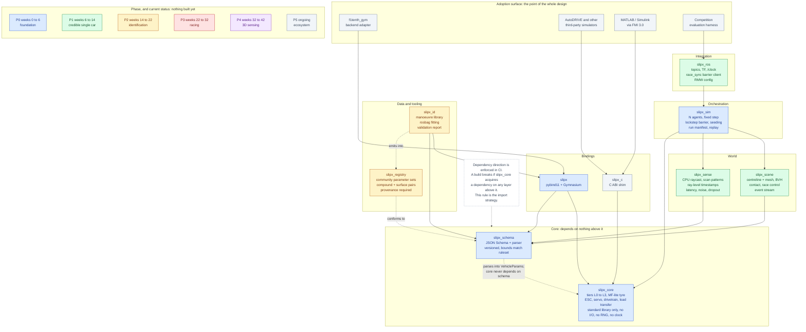

```mermaid
flowchart TB

    subgraph EXT["Adoption surface: the point of the whole design"]
        GYM["f1tenth_gym<br/>backend adapter"]
        SIMX["AutoDRIVE and other<br/>third-party simulators"]
        MTLB["MATLAB / Simulink<br/>via FMI 3.0"]
        COMP["Competition<br/>evaluation harness"]
    end

    subgraph TOOL["Data and tooling"]
        REG["slipx_registry<br/>community parameter sets<br/>compound + surface pairs<br/>provenance required"]
        IDT["slipx_id<br/>manoeuvre library<br/>rosbag fitting<br/>validation report"]
    end

    subgraph INTEG["Integration"]
        ROS["slipx_ros<br/>topics, TF, /clock<br/>race_sync barrier client<br/>RMW config"]
    end

    subgraph ORCH["Orchestration"]
        SIM["slipx_sim<br/>N agents, fixed step<br/>lockstep barrier, seeding<br/>run manifest, replay"]
    end

    subgraph WORLD["World"]
        SCENE["slipx_scene<br/>centreline + mesh, BVH<br/>contact, race control<br/>event stream"]
        SENSE["slipx_sense<br/>CPU raycast, scan patterns<br/>ray-level timestamps<br/>latency, noise, dropout"]
    end

    subgraph BIND["Bindings"]
        PY["slipx<br/>pybind11 + Gymnasium"]
        CABI["slipx_c<br/>C ABI shim"]
    end

    subgraph CORELAYER["Core: depends on nothing above it"]
        SCH["slipx_schema<br/>JSON Schema + parser<br/>versioned, bounds match ruleset"]
        CORE["slipx_core<br/>tiers L0 to L3, MF-lite tyre<br/>ESC, servo, drivetrain, load transfer<br/>standard library only, no I/O, no RNG, no clock"]
    end

    GYM --> PY
    SIMX --> CABI
    MTLB --> CABI
    COMP --> ROS

    IDT --> PY
    IDT --> SCH
    REG -. "conforms to" .-> SCH
    IDT -. "emits into" .-> REG

    ROS --> SIM
    SIM --> SCENE
    SIM --> SENSE
    SIM --> CORE
    SCENE --> SCH
    SENSE --> SCH
    PY --> CORE
    PY --> SCH
    CABI --> CORE
    SCH -. "parses into VehicleParams;<br/>core never depends on schema" .-> CORE

    RULE["Dependency direction is enforced in CI.<br/>A build breaks if slipx_core acquires<br/>a dependency on any layer above it.<br/>This rule is the import strategy."]
    RULE -.-> CORELAYER

    subgraph LEGEND["Phase, and current status: nothing built yet"]
        K0["P0 weeks 0 to 6<br/>foundation"]
        K1["P1 weeks 6 to 14<br/>credible single car"]
        K2["P2 weeks 14 to 22<br/>identification"]
        K3["P3 weeks 22 to 32<br/>racing"]
        K4["P4 weeks 32 to 42<br/>3D sensing"]
        K5["P5 ongoing<br/>ecosystem"]
        K0 ~~~ K1 ~~~ K2 ~~~ K3 ~~~ K4 ~~~ K5
    end

    classDef p0 fill:#dbeafe,stroke:#1d4ed8,color:#1e3a8a
    classDef p1 fill:#dcfce7,stroke:#15803d,color:#14532d
    classDef p2 fill:#fef3c7,stroke:#b45309,color:#78350f
    classDef p3 fill:#fee2e2,stroke:#b91c1c,color:#7f1d1d
    classDef p4 fill:#f3e8ff,stroke:#7e22ce,color:#581c87
    classDef p5 fill:#f1f5f9,stroke:#64748b,color:#334155
    classDef note fill:#ffffff,stroke:#94a3b8,color:#334155,stroke-dasharray:4 3

    class CORE,SCH,PY,SIM p0
    class SENSE,SCENE,ROS p1
    class IDT,REG p2
    class CABI,GYM,SIMX,MTLB,COMP p5
    class RULE note
    class K0 p0
    class K1 p1
    class K2 p2
    class K3 p3
    class K4 p4
    class K5 p5
```