# 3. Vehicle models

There is no such thing as *the* model of a car. There is a ladder of them, each
rung adding a mechanism and a computational cost, and the useful skill is not
knowing the equations. It is knowing **which questions a given rung is allowed
to answer**, and recognising when you have asked one it cannot.

That skill matters more in autonomous racing than in most fields, because you
will typically run two or three different models at once: a cheap one inside a
controller predicting a second into the future at 50 Hz, and an expensive one
in a simulator claiming to tell you what the car would really have done.

**Before you start.** Read [1. Tyres and grip](01-tyres-and-grip.md) and
[2. Load transfer](02-load-transfer.md). You need to be comfortable with a
state vector and an ordinary differential equation.



## Rung zero: the point mass

The car is a point with a maximum acceleration in every direction, bounded by
the friction ellipse. No geometry, no heading, no tyres.

Useless for control and indispensable for planning. Almost every lap-time
estimate and racing-line optimiser starts here, because the resulting problem
is small enough to solve to optimality over an entire lap. The
[speed profile article](06-speed-and-the-gg-diagram.md) is entirely a point
mass argument.

What it cannot tell you: anything about whether the car is stable, anything
about steering, and anything that distinguishes one chassis from another.

## Rung one: the kinematic bicycle

Merge each axle's two wheels into one, put the car on a plane, and assume
**the tyres do not slip at all**: each wheel travels exactly where it points.
Four states: position `x`, `y`, heading `psi`, speed `v`.

```
beta      = atan(l_r tan(delta) / L)          sideslip, purely geometric
x'        = v cos(psi + beta)
y'        = v sin(psi + beta)
psi'      = v cos(beta) tan(delta) / L
```

The whole model is Ackermann geometry: given a steering angle, the car
describes a circle of the radius that geometry demands, and speed does not
enter the turning at all.

**What it is good for.** It is cheap, it has no singularity at standstill, and
it is accurate when the tyres are barely working. That combination makes it the
standard internal model for model predictive control, the standard model for
mass reinforcement-learning rollouts, and a perfectly honest teaching example.

**What it cannot say.** Everything to do with tyres. Mass, weight distribution,
centre of gravity height, tyre compound and drivetrain have literally no
representation, so changing any of them changes nothing. Most importantly it
has **no friction limit**: ask it to corner at three g and it will, without
complaint, because it has no mechanism by which grip could run out.

The usual rule of thumb is that it is reasonable below about 0.4 g of lateral
acceleration. Notice that this depends on the tyres, not on speed alone: soft
tyres depart from it sooner.

## Rung two: the dynamic bicycle

Keep one tyre per axle, but now let the tyres slip and make force from that
slip. Two more states, lateral velocity `v_y` and yaw rate `r`, giving six.

```
alpha_f = atan2(v_y + l_f r, v_x) - delta        slip angles
alpha_r = atan2(v_y - l_r r, v_x)
Fy_f    = -C_f alpha_f                            linear tyres
Fy_r    = -C_r alpha_r

m (v_x' - v_y r) = Fx - Fy_f sin(delta) - F_resist
m (v_y' + v_x r) = Fy_f cos(delta) + Fy_r
Iz r'            = l_f Fy_f cos(delta) - l_r Fy_r
```

The `v_y r` and `v_x r` terms are there because the body frame is rotating;
forgetting them is a common and confusing bug, because the model still looks
plausible and is quietly wrong in every corner.

**What this buys.** Real sideslip, so the car can be pointing somewhere other
than where it is going. Real yaw dynamics, so a steering input produces a
transient before it produces a steady state. And an **understeer gradient**,
which is the whole subject of [article 4](04-understeer-and-oversteer.md) and
the first genuinely useful thing a model can tell you about a specific car.

**What it still cannot say.** Two things, and both are consequential.

There is no load transfer, because a single-track model has no track: the two
wheels of an axle are one wheel. So CoG height is inert, and every result from
[article 2](02-load-transfer.md) is invisible.

And with linear tyres there is no peak, so lateral force grows without bound
with slip angle. Implementations usually clip it at `mu Fz`, which stops the
car cornering at absurd rates but is not the same thing as saturation: a
clipped tyre has no falling branch, so the positive feedback that spins a car
does not exist. The model slides at the limit and tidily recovers.

You can put a Magic Formula tyre into a bicycle model, and people do. That
buys you saturation and spin while still leaving load transfer out.

## Rung three: the double track

Four wheels, each with its own vertical load, its own slip angle and slip
ratio, and its own tyre model. Around fifteen states once you include wheel
speeds, the actual steering angle behind its servo, and the battery.

This is the first rung on which the two things from articles 1 and 2 can
interact:

- load transfer computes a vertical load per corner;
- load sensitivity turns that into a different `mu` per corner;
- the tyre model turns slip into force at that load;
- the forces produce accelerations, which change the load transfer.

That loop is what makes different cars behave differently. Raise the CoG on a
double-track model and the car genuinely gets worse, for the right reason and
by the right amount. Below this rung, the parameter is inert.

It is also the first rung where a differential matters, where you can model a
locked rear axle dragging the car straight on, and where the answer to "which
tyre let go first" exists at all.

**What it costs.** Roughly four times the tyre evaluations of a bicycle model,
plus a chicken-and-egg problem worth knowing about: the load transfer needs the
accelerations, and the accelerations need the tyre forces, which need the
loads. Implementations either lag the loads by one step or solve the loop with
a fixed number of iterations. Both are defensible; neither is exact.

## Rung four and beyond

Add tyre temperature and wear, suspension kinematics with real roll and pitch
degrees of freedom, drivetrain compliance, chassis flex. Each of these is a
genuine effect and each needs parameters that are harder to obtain than the
last. This is where the identifiability question bites hardest: a model with
parameters you cannot measure is not more accurate than a simpler one, it is
just more confident.

## Choosing

| Question | Lowest rung that can answer it |
|---|---|
| How long will a lap take? | point mass |
| Where should my controller aim over the next 0.5 s? | kinematic bicycle |
| Is this steering controller stable at 8 m/s? | dynamic bicycle |
| Will the car understeer out of this corner? | dynamic bicycle |
| Does moving the battery back help? | double track |
| Why did it spin at the exit and not the entry? | double track, MF tyres |
| How much does the car slow over a twenty-lap run? | thermal model |

Two working rules.

**Use the cheapest model that contains the mechanism you are asking about.** A
double-track model does not make a controller better if the controller only
needs a 0.3 s prediction at half a g. It makes it slower.

**Never compare results from different rungs without saying so.** A lap time
from a kinematic model and one from a double-track model are not the same
measurement, and the difference between them is not an error bar.

> **In SlipX.** These rungs are called tiers L0 to L3 and are selected at
> construction behind one interface, so the same controller can be pointed at
> each in turn. Asking for a tier that is not implemented raises rather than
> quietly returning a simpler one, on the grounds that a trajectory labelled L2
> which is actually L1 is worse than no trajectory
> ([ADR-0005](../adr/0005-tiers-throw-rather-than-fall-back.md)). Watching a
> controller that tracks the line at L1 and spins the car at L2 is the intended
> way to learn what tyre saturation does.

## A note on validation

A model that reproduces your data is not thereby correct, and a model that does
not is not thereby wrong. The interesting question is which mechanism accounts
for the discrepancy, and answering it usually means finding an experiment where
two candidate models disagree sharply and running that one.

Be specific about what has actually been validated. "This simulator has been
validated" is not a claim; "the yaw rate response to a step steer at 4 m/s
matches within eight per cent on this surface with this tyre" is. The second is
much less impressive and infinitely more useful.

## In one paragraph

Models form a ladder: a point mass with a friction limit, a kinematic bicycle
with geometry but no tyres, a dynamic bicycle with tyres but no load transfer,
a double track with both, and beyond that thermal and suspension effects. Each
rung makes a set of parameters relevant that were inert below it, and the
practical skill is knowing which rung your question needs, then using the
cheapest one that has it.

## Further reading

- Rajamani, *Vehicle Dynamics and Control*, 2nd ed., Springer, 2012, chapter 2,
  which derives the kinematic and dynamic bicycle models carefully and is the
  source most autonomous driving papers implicitly follow.
- Kong, Pfeiffer, Schildbach and Borrelli, "Kinematic and Dynamic Vehicle
  Models for Autonomous Driving Control Design", *IEEE Intelligent Vehicles
  Symposium*, 2015. Directly compares the two rungs for MPC and quantifies when
  the kinematic one stops being adequate. Read this one if you read only one
  paper here.
- Althoff, Koschi and Manzinger, "CommonRoad: Composable Benchmarks for Motion
  Planning on Roads", *IEEE Intelligent Vehicles Symposium*, 2017, whose vehicle
  model documentation gives precise state definitions for a ladder much like
  this one.

---

Previous: [2. Load transfer](02-load-transfer.md) ·
Next: [4. Understeer and oversteer](04-understeer-and-oversteer.md) ·
[Series index](README.md)
