# 4. Understeer and oversteer

Two words that get used constantly and defined rarely. The common version,
"understeer is when the front slides and oversteer is when the back slides",
is not exactly wrong but it describes a symptom at the limit and hides the
useful idea, which applies at every speed and every cornering force including
the gentle ones.

The useful idea is about **how much steering a car needs, and how that amount
changes with speed**.

**Before you start.** Read [1. Tyres and grip](01-tyres-and-grip.md), for slip
angle and cornering stiffness, and [3. Vehicle models](03-vehicle-models.md),
for the dynamic bicycle model. [2. Load transfer](02-load-transfer.md) is
needed only for the section on limit behaviour.



## The steady-state cornering equation

Put a car in a steady circle of radius `R` at speed `v` and ask what steering
angle it needs. From the geometry alone, with no tyre slip, the answer is the
Ackermann angle `L / R`. With slipping tyres you also need enough extra
steering to generate the slip angles that make the cornering force, and working
that through the bicycle model gives:

```
delta = L / R + K a_y
```

where `a_y = v² / R` is the lateral acceleration and `K` is the **understeer
gradient**, in radians per m/s². For the bicycle model:

```
K = (m / L) (l_r / C_f - l_f / C_r)
```

This is the equation the whole subject reduces to, so it is worth reading
slowly. The first term is geometry: it depends on the corner, not on the speed.
The second term is the tyres: it depends on how hard the car is cornering.

- `K > 0`: **understeer**. More steering is needed as the car goes faster
  around the same circle. Equivalently, at a fixed steering angle, the car runs
  progressively wider as speed rises.
- `K = 0`: **neutral steer**. The Ackermann angle works at every speed, and the
  radius is a function of steering angle alone.
- `K < 0`: **oversteer**. Less steering is needed as speed rises, and at a fixed
  steering angle the car tightens its line.

Look at what makes `K` positive: a large `l_r` (CoG towards the front) or a
small `C_f` (soft front tyres). A nose-heavy car with soft front tyres
understeers, which matches intuition.

Notice also what does **not** appear: the steering angle, the radius, the
speed. `K` is a property of the car. Measuring it at two speeds and getting the
same number is a much stronger check on a model than matching a textbook
formula once.

## Characteristic and critical speed

The sign of `K` is not a preference, it is a stability property, and this is
where the two cases stop being mirror images.

For an understeering car, define the **characteristic speed**:

```
v_char = sqrt(L / K)
```

At this speed the car needs exactly twice the Ackermann angle. Nothing bad
happens there; it is a convenient way to quote how strongly a car understeers.

For an oversteering car, `K < 0`, define the **critical speed**:

```
v_crit = sqrt(-L / K)
```

At this speed the required steering angle passes through **zero**, and above it
the sign flips: the car needs steering *away* from the corner to hold a steady
circle. That is the mathematical signature of an unstable vehicle. Above
`v_crit`, yaw disturbances grow rather than decay, and a driver or controller
must actively stabilise the car every moment it is moving.

The feedback loop is worth spelling out. The car rotates slightly more than
intended. That increases the rear slip angle. In an oversteering car the rear
axle's response is not enough to arrest the extra rotation, so the yaw rate
grows, which increases the rear slip angle further. Once the rear tyres are
past their peak, the loop closes with the falling branch from
[article 1](01-tyres-and-grip.md), and it becomes very fast indeed.

This asymmetry is why road cars are built to understeer, and why a good chunk
of autonomous racing controllers implicitly assume it: an understeering car
that exceeds its limit runs wide, which is embarrassing and survivable, while
an oversteering one departs.

## Limit behaviour is a different question

Everything above concerns the linear region, where `K` is a constant. Near the
limit it stops being one, and a car can perfectly well understeer at 0.3 g and
oversteer at 0.9 g. Two mechanisms account for most of that.

**Load transfer.** From [article 2](02-load-transfer.md), transferring load
across an axle costs it grip, because peak friction falls with load. Transfer
more of the total across the front axle than the rear and the front loses
proportionally more, so the car understeers more at the limit. This is exactly
the knob an anti-roll bar turns: stiffening the front bar sends more of the
total lateral transfer through the front axle and pushes the balance towards
understeer. It is counter-intuitive the first time, because stiffening
something usually makes it work better, and here it makes that end work worse.

**Tyre saturation.** Whichever axle reaches the peak of its curve first
determines what the car does at the limit, and after that the linear-region
`K` says nothing about it.

The named cases you will hear:

- **Terminal understeer.** The front tyres saturate first. The car runs wide
  and adding steering makes it worse, because past the peak more slip angle
  means less force.
- **Power oversteer.** Longitudinal force at the driven axle consumes part of
  the friction ellipse, leaving less for cornering. On a rear-driven car,
  applying power mid-corner can push the rear tyres over their limit.
- **Lift-off oversteer.** Releasing the throttle mid-corner transfers load
  forward, unloading the rear axle and reducing its grip just as the car is
  asking it to hold a corner. The car tucks into the turn. This one surprises
  people because the input, doing less, feels like a safety measure.

## Why this matters for an autonomous car

A path-tracking controller is, at heart, a map from a desired path to a
steering angle. Almost all of them contain an assumption about the
relationship, usually the Ackermann angle plus a correction, and that
assumption is the linear-region equation above.

Three practical consequences.

**Feed-forward wants `K`.** If your controller computes `delta = L / R` and
lets feedback deal with the rest, then at 0.6 g the feedback is being asked to
make up `K a_y`, which is a steady-state error the loop has to fight. Adding
`K a_y` to the feed-forward removes it. This is the cheapest accuracy
improvement available to a pure pursuit controller, and it needs one number for
the car.

**Gain scheduling.** The relationship between steering and yaw rate depends on
speed. A gain that is well tuned at 3 m/s is sluggish at 8 m/s, and one tuned
at 8 m/s oscillates at 3 m/s. Most of that is captured by scheduling on speed.

**An oversteering car changes the problem.** Above the critical speed you are
no longer tracking a path, you are stabilising a plant while tracking a path.
If your car is set up to oversteer, and small cars often are because the rear
tyres wear faster, controllers that were fine last week can become marginal
without anything in the code changing.

> **In SlipX.** The dynamic bicycle tier has a genuine understeer gradient and
> reproduces the textbook formula, which its analytical tests assert. It cannot
> spin, because a clipped linear tyre has no falling branch, so the limit
> behaviour in this article needs the double-track tier and a Magic Formula
> tyre. That gap is deliberate and documented rather than papered over.

## Measuring it on your own car

`K` is one of the easier things to identify with the sensors already on a
competition car, which is why it is a standard manoeuvre.

**Constant radius.** Mark a circle. Drive it at a series of steady speeds,
recording steering angle and speed. Plot `delta` against `v²/R`. The slope is
`K` and the intercept should be `L / R`, which is a free check on your data: if
the intercept is not the Ackermann angle, something in the measurement is
wrong.

**Constant steering.** Hold a steering angle and slowly increase speed,
recording yaw rate and speed. Radius is `v / r`, and the same plot follows.
Easier to drive, more sensitive to steering offset.

Two things to watch. Steering angle means the **road wheel** angle, not the
servo command, and the linkage between them is nonlinear on most small cars.
And stay in the linear region: once either axle approaches its peak, `K` is no
longer a constant and you are fitting a straight line to a curve.

## In one paragraph

Understeer and oversteer describe how much steering a car needs as it corners
harder, captured by one number, the understeer gradient `K`, in
`delta = L/R + K a_y`. Positive means it needs more steering with speed and is
stable; negative means less, and above a critical speed it is unstable and must
be actively stabilised. Near the limit the linear picture breaks down, and
which axle saturates first, driven mostly by load transfer, decides what the car
actually does.

## Further reading

- Gillespie, *Fundamentals of Vehicle Dynamics*, SAE International, 1992,
  chapter 6. The clearest derivation of the understeer gradient, the
  characteristic speed and the critical speed in print.
- Milliken and Milliken, *Race Car Vehicle Dynamics*, SAE International, 1995,
  for the handling diagram and for what a race engineer does with roll
  stiffness distribution.
- Rajamani, *Vehicle Dynamics and Control*, 2nd ed., Springer, 2012, section
  2.6, for the same material with the stability analysis written out.

---

Previous: [3. Vehicle models](03-vehicle-models.md) ·
Next: [5. The racing line](05-the-racing-line.md) ·
[Series index](README.md)
